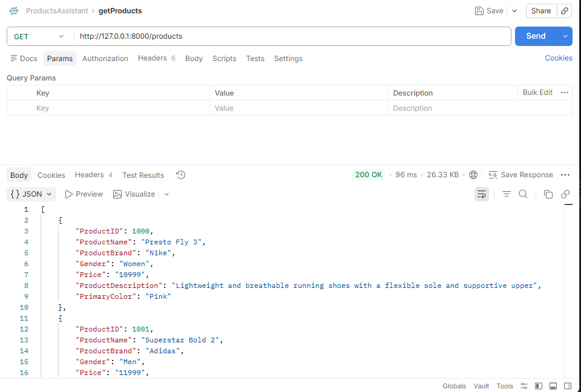
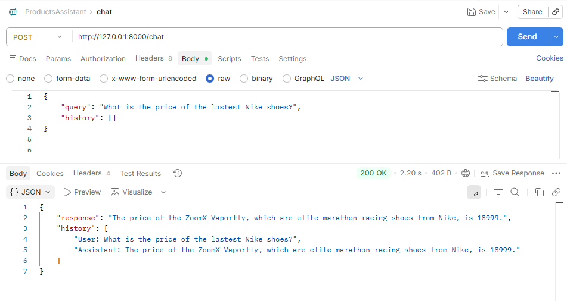
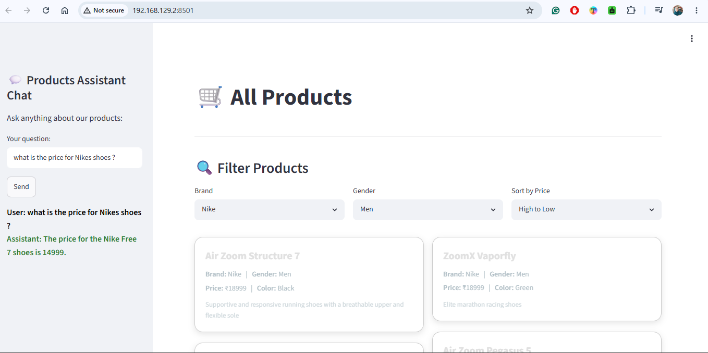

# 🛍️ Products Assistant Chatbot

A Retrieval-Augmented Generation (RAG) chatbot that helps customers search products and answer product-related questions using **FastAPI**, **Google Gemini**, **Pinecone**, **MySQL**, and **Streamlit**.

---

## Features

- 🤖 AI-powered customer support chatbot
- 🔍 Semantic product search using Pinecone
- 💬 Google Gemini for natural language responses
- 🗄️ MySQL product database
- ⚡ FastAPI REST API
- 🎨 Streamlit frontend
- 📦 Product listing endpoint

---

## Tech Stack

- Python 3.13+
- FastAPI
- Streamlit
- Google Gemini
- LangChain
- Pinecone
- MySQL
- Pandas

---

## Project Structure

```text
products-ai-chatbot/
│
├── backend/
│   ├── database/
│   │   └── mysql.py
│   │
│   ├── routes/
│   │   ├── chat.py
│   │   └── products.py
│   │
│   ├── services/
│   │   ├── gemini_chain.py
│   │   └── vectore_store.py
│   │
│   └── main.py
│
├── data/
│   ├── data_insertion.py
│   └── shop-product-catalog.csv
│
├── embeddings/
│   └── sync_pinecone.py
│
├── frontend/
│   └── app.py
│
├── .env
├── requirements.txt
├── pyproject.toml
└── README.md
```

---

## Installation

### 1. Clone the repository

```bash
git clone https://github.com/Asmaathabet/Products_AI_Assistant.git

cd Products-Assistant-AI
```

### 2. Create a virtual environment

```bash
python -m venv .venv
```

### 3. Activate the virtual environment

**Windows**

```bash
.\.venv\Scripts\activate
```

**Linux/macOS**

```bash
source .venv/bin/activate
```

### 4. Install dependencies

Using pip

```bash
pip install -r requirements.txt
```

or using uv

```bash
uv sync
```

---

## Environment Variables

Create a `.env` file in the project root.

```env
GOOGLE_API_KEY=your_google_api_key

PINECONE_API_KEY=your_pinecone_api_key

DB_HOST=localhost
DB_USER=root
DB_PASSWORD=your_password
DB_NAME=shop_assistant
```

---

## Import Product Data

Insert the CSV data into MySQL.

```bash
python data/data_insertion.py
```

---

## Create Embeddings (Run Once)

Upload product embeddings to Pinecone.

```bash
python embeddings/sync_pinecone.py
```

This step only needs to be executed once or whenever the product catalog changes.

---

## Run the Backend

```bash
uvicorn backend.main:app --reload
```

Backend URL

```
http://127.0.0.1:8000
```

Swagger Documentation

```
http://127.0.0.1:8000/docs
```

---

## Run the Frontend

```bash
streamlit run frontend/app.py
```

Frontend URL

```
http://localhost:8501
```

---

## API Endpoints

### Products

```
GET /products
```

Returns all products stored in the MySQL database.

---

### Chat

```
POST /chat
```

Example request

```json
{
  "query": "What is the price of the latest Nike shoes?",
  "history": []
}
```

Example response

```json
{
  "response": "...",
  "history": [
    "User: What is the price of the latest Nike shoes?",
    "Assistant: ..."
  ]
}
```

---

## Screenshots

### Products API



---

### Chat API



---

### Products AI Assistant



---

## Troubleshooting

### Virtual Environment Issues

If `pip` is missing from the virtual environment:

```bash
.\.venv\Scripts\python.exe -m ensurepip

.\.venv\Scripts\python.exe -m pip install --upgrade pip
```

---

### Recreate Pinecone Embeddings

If products are updated:

```bash
python embeddings/sync_pinecone.py
```

---

## Dependencies

The project dependencies are managed through **pyproject.toml** and include:

- FastAPI
- Uvicorn
- LangChain
- Google Gemini
- Pinecone
- MySQL Connector
- Pandas
- Streamlit
- python-dotenv
- tqdm
